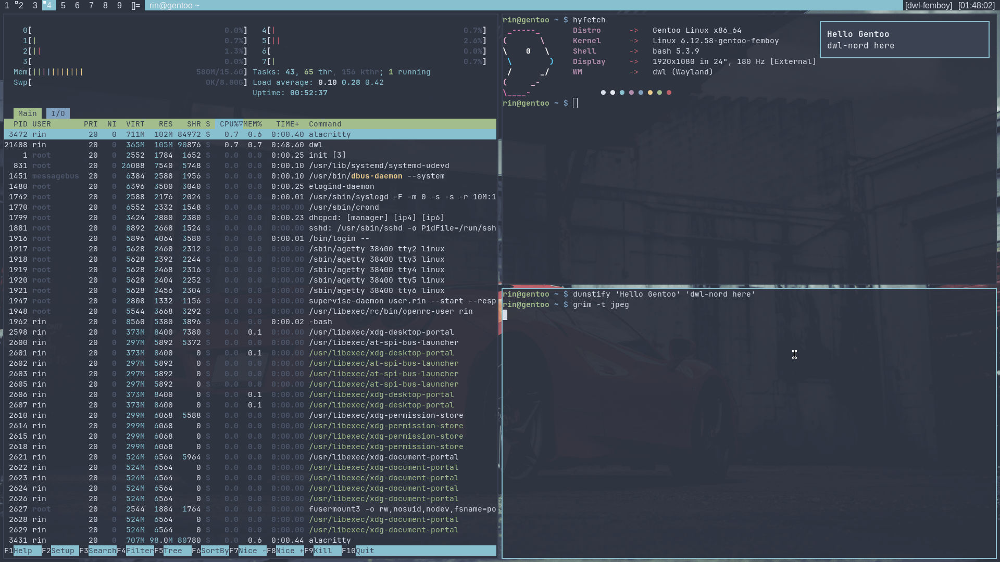

# dwlnord
## PREVIEW


## DEPENDENCIES
### dwl deps:
- libinput
- wayland
- xkbcommon
- wayland-protocols (compile-time only)
- pkg-config (compile-time only)
- libxcb
- wlroots (compiled with X11 support)
- Xwayland
### needed pkgs:
- wmenu
- swaybg
- dunst
- alacritty
- JetBrains Mono font
## HOW TO USE
1. clone by ```git clone https://github.com/nyauuka/dwlnord.git```
2. ```cp -r dwlnord/.config ~/```
3. ```cd ~/.config/dwl```
4. ```sudo make clean install```
5. ```cd - && sudo cp dwlnord/scripts/* /usr/local/bin/```
## PATCHES
- autostart
- bar
- gaps
## STRUCTURE
```
dwlnord
├── .config
│   ├── alacritty
│   │   └── alacritty.toml
│   ├── dunst
│   │   └── dunstrc
│   ├── dwl
│   │   ├── CHANGELOG.md
│   │   ├── client.h
│   │   ├── config.def.h
│   │   ├── config.def.h.orig
│   │   ├── config.mk
│   │   ├── drwl.h
│   │   ├── dwl.1
│   │   ├── dwl.c
│   │   ├── dwl.c.orig
│   │   ├── dwl.desktop
│   │   ├── LICENSE
│   │   ├── LICENSE.dwm
│   │   ├── LICENSE.sway
│   │   ├── LICENSE.tinywl
│   │   ├── .mailmap
│   │   ├── Makefile
│   │   ├── patches
│   │   │   ├── autostart.patch
│   │   │   ├── bar.patch
│   │   │   └── gaps.patch
│   │   ├── protocols
│   │   │   ├── wlr-layer-shell-unstable-v1.xml
│   │   │   └── wlr-output-power-management-unstable-v1.xml
│   │   ├── README.md
│   │   ├── util.c
│   │   ├── util.h
│   │   └── wallpaper
│   │       └── car.png
│   └── kanshi
│       └── config
├── .git
├── README.md
├── screenshots
│   ├── clean.jpeg
│   └── tiles.jpeg
└── scripts
    └── bardwl
```
